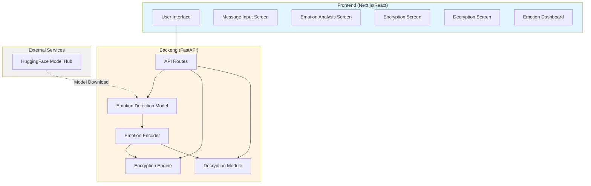

# Design Document: EMOTION CIPHER

## Overview

EMOTION CIPHER is a full-stack web application that implements emotion-aware encryption, combining natural language processing with cryptography to create a unique privacy-preserving communication system. The application consists of a React/Next.js frontend with TailwindCSS and Framer Motion for animations, and a Python FastAPI backend that integrates HuggingFace Transformers for emotion detection and PyCryptodome for AES-256 encryption.

The core innovation is the emotion-aware key derivation mechanism: instead of simply attaching emotion labels to encrypted messages, the emotional signature directly influences the encryption key, ensuring that identical messages with different emotional tones produce different ciphertexts. This creates a cryptographic binding between content and emotion while preserving privacy.

## Architecture

### System Architecture



### Data Flow

**Encryption Flow:**
1. User enters message in frontend
2. Frontend sends message + user_secret to `/api/encrypt`
3. Backend analyzes message with Emotion_Detector
4. Emotion_Encoder creates Emotion_Hash from Emotion_Vector
5. Encryption_Engine derives Final_Key from Base_Key + Emotion_Hash
6. AES-256 encrypts message with Final_Key
7. Backend returns Encrypted_Packet (ciphertext + emotion metadata)
8. Frontend displays encrypted result with emotion visualization

**Decryption Flow:**
1. User provides Encrypted_Packet + user_secret
2. Frontend sends to `/api/decrypt`
3. Backend extracts Emotion_Signature from packet
4. Decryption_Module reconstructs Final_Key using Emotion_Signature
5. AES-256 decrypts ciphertext
6. Backend re-analyzes decrypted message for emotion verification
7. Frontend displays original message + emotion verification status

## Components and Interfaces

### Backend Components

#### 1. Emotion Detection Model (`emotion_model.py`)

**Purpose:** Analyzes text and extracts emotional content using pretrained transformer model.

**Interface:**
```python
class EmotionDetector:
    def __init__(self):
        """Load j-hartmann/emotion-english-distilroberta-base model"""
        
    def detect_emotions(self, text: str) -> EmotionVector:
        """
        Analyze text and return emotion scores
        
        Args:
            text: Input message to analyze
            
        Returns:
            EmotionVector with scores for joy, sadness, anger, fear, surprise, anxiety
            
        Raises:
            EmotionDetectionError: If analysis fails
        """
        
    def _normalize_scores(self, raw_scores: dict) -> dict:
        """Normalize emotion scores to [0, 1] range"""
```

**Key Responsibilities:**
- Load and cache HuggingFace model
- Perform emotion inference on text
- Normalize emotion scores
- Handle empty/invalid input gracefully
- Support GPU acceleration when available

#### 2. Emotion Encoder (`emotion_encoder.py`)

**Purpose:** Transforms emotion vectors into cryptographic signatures.

**Interface:**
```python
class EmotionEncoder:
    def encode_emotion_hash(self, emotion_vector: EmotionVector) -> str:
        """
        Create SHA-256 hash from emotion vector
        
        Args:
            emotion_vector: Normalized emotion scores
            
        Returns:
            Hexadecimal emotion hash string
        """
        
    def extract_dominant_emotions(self, emotion_vector: EmotionVector, 
                                  threshold: float = 0.3) -> List[str]:
        """
        Identify emotions above intensity threshold
        
        Args:
            emotion_vector: Emotion scores
            threshold: Minimum intensity to be considered dominant
            
        Returns:
            List of emotion names sorted by intensity (descending)
        """
        
    def calculate_intensity(self, emotion_vector: EmotionVector) -> float:
        """
        Calculate overall emotional intensity
        
        Returns:
            Intensity score in [0, 1] range
        """
```

**Key Responsibilities:**
- Serialize emotion vectors consistently
- Generate deterministic emotion hashes
- Extract dominant emotions
- Calculate aggregate emotional intensity

#### 3. Encryption Engine (`encryption_engine.py`)

**Purpose:** Performs emotion-aware AES-256 encryption.

**Interface:**
```python
class EncryptionEngine:
    def encrypt(self, message: str, user_secret: str, 
                emotion_hash: str) -> EncryptedPacket:
        """
        Encrypt message with emotion-aware key derivation
        
        Args:
            message: Plaintext message
            user_secret: User's encryption secret
            emotion_hash: Emotion signature hash
            
        Returns:
            EncryptedPacket with ciphertext and emotion metadata
        """
        
    def _derive_base_key(self, user_secret: str) -> bytes:
        """Derive base key from user secret using SHA-256"""
        
    def _derive_final_key(self, base_key: bytes, emotion_hash: str) -> bytes:
        """Combine base key with emotion hash to create final key"""
        
    def _aes_encrypt(self, plaintext: str, key: bytes) -> bytes:
        """Perform AES-256-CBC encryption with PKCS7 padding"""
```

**Key Responsibilities:**
- Derive Base_Key from user secret
- Combine Base_Key with Emotion_Hash to create Final_Key
- Perform AES-256-CBC encryption
- Generate random initialization vectors (IV)
- Package encrypted data with emotion metadata

#### 4. Decryption Module (`decryptor.py`)

**Purpose:** Reverses emotion-aware encryption and verifies emotional authenticity.

**Interface:**
```python
class DecryptionModule:
    def __init__(self, emotion_detector: EmotionDetector):
        """Initialize with emotion detector for verification"""
        
    def decrypt(self, encrypted_packet: EncryptedPacket, 
                user_secret: str) -> DecryptionResult:
        """
        Decrypt message and verify emotion signature
        
        Args:
            encrypted_packet: Encrypted data with emotion metadata
            user_secret: User's decryption secret
            
        Returns:
            DecryptionResult with plaintext and verification status
            
        Raises:
            DecryptionError: If decryption fails
        """
        
    def _verify_emotion_signature(self, message: str, 
                                  original_signature: EmotionSignature) -> bool:
        """Re-analyze message and compare with original emotion signature"""
```

**Key Responsibilities:**
- Reconstruct Final_Key from Emotion_Signature
- Perform AES-256-CBC decryption
- Verify emotional authenticity by re-analysis
- Handle decryption failures gracefully

#### 5. API Routes (`api_routes.py`)

**Purpose:** Expose backend functionality via REST API.

**Endpoints:**

```python
@app.post("/api/encrypt")
async def encrypt_message(request: EncryptRequest) -> EncryptResponse:
    """
    Encrypt message with emotion-aware encryption
    
    Request Body:
        {
            "message": str,
            "user_secret": str
        }
        
    Response:
        {
            "encrypted_packet": {
                "encrypted_text": str (base64),
                "emotion_signature": {
                    "joy": float,
                    "sadness": float,
                    "anger": float,
                    "fear": float,
                    "surprise": float,
                    "anxiety": float
                },
                "dominant_emotions": List[str],
                "emotional_intensity": float
            }
        }
    """

@app.post("/api/decrypt")
async def decrypt_message(request: DecryptRequest) -> DecryptResponse:
    """
    Decrypt message and verify emotion signature
    
    Request Body:
        {
            "encrypted_packet": EncryptedPacket,
            "user_secret": str
        }
        
    Response:
        {
            "message": str,
            "emotion_verified": bool,
            "original_emotions": EmotionSignature,
            "detected_emotions": EmotionSignature
        }
    """

@app.post("/api/analyze")
async def analyze_emotion(request: AnalyzeRequest) -> AnalyzeResponse:
    """
    Analyze emotion without encryption
    
    Request Body:
        {
            "message": str
        }
        
    Response:
        {
            "emotion_vector": EmotionVector,
            "dominant_emotions": List[str],
            "emotional_intensity": float
        }
    """
```

### Frontend Components

#### 1. Message Input Screen

**Purpose:** Capture user message and initiate encryption flow.

**Features:**
- Large textarea with character count
- Real-time input validation
- Glassmorphism card design
- Secret key input field
- Animated "Encrypt" button

#### 2. Emotion Analysis Screen

**Purpose:** Display emotion detection results with engaging animations.

**Features:**
- Animated emotion bars showing intensity
- Radar chart for emotional profile
- Color-coded emotion labels
- Smooth transitions using Framer Motion
- Loading animation during analysis

#### 3. Encryption Screen

**Purpose:** Display encrypted result and enable copying.

**Features:**
- Monospace ciphertext display
- Copy-to-clipboard button with confirmation
- Emotion metadata summary
- Download as JSON option
- Visual encryption animation

#### 4. Decryption Screen

**Purpose:** Decrypt messages and verify emotional authenticity.

**Features:**
- Encrypted packet input (JSON)
- Secret key input
- Original message display
- Emotion verification badge (match/mismatch)
- Side-by-side emotion comparison

#### 5. Emotion Dashboard

**Purpose:** Visualize emotional analytics without revealing message content.

**Features:**
- Aggregate emotion statistics
- Emotional heatmap by time period
- Trend charts for emotion tracking
- Color aura animation for dominant emotion
- Responsive grid layout

## Data Models

### EmotionVector

```python
@dataclass
class EmotionVector:
    joy: float          # [0, 1]
    sadness: float      # [0, 1]
    anger: float        # [0, 1]
    fear: float         # [0, 1]
    surprise: float     # [0, 1]
    anxiety: float      # [0, 1]
    
    def to_dict(self) -> dict:
        """Serialize to dictionary"""
        
    def to_bytes(self) -> bytes:
        """Serialize to bytes for hashing"""
```

### EncryptedPacket

```python
@dataclass
class EncryptedPacket:
    encrypted_text: str              # Base64-encoded ciphertext
    iv: str                          # Base64-encoded initialization vector
    emotion_signature: EmotionVector # Public emotion metadata
    dominant_emotions: List[str]     # Sorted by intensity
    emotional_intensity: float       # Overall intensity [0, 1]
    
    def to_json(self) -> str:
        """Serialize to JSON string"""
        
    @classmethod
    def from_json(cls, json_str: str) -> 'EncryptedPacket':
        """Deserialize from JSON string"""
```

### DecryptionResult

```python
@dataclass
class DecryptionResult:
    message: str                      # Decrypted plaintext
    emotion_verified: bool            # True if emotions match
    original_emotions: EmotionVector  # From encrypted packet
    detected_emotions: EmotionVector  # Re-analyzed from plaintext
    verification_threshold: float     # Similarity threshold used
```

## Correctness Properties

*A property is a characteristic or behavior that should hold true across all valid executions of a system—essentially, a formal statement about what the system should do. Properties serve as the bridge between human-readable specifications and machine-verifiable correctness guarantees.*

### Core Cryptographic Properties

Property 1: Encryption/Decryption Round Trip
*For any* message and user secret, encrypting then decrypting with the same secret should return the original message unchanged.
**Validates: Requirements 5.3**

Property 2: Emotion Influences Ciphertext
*For any* message encrypted with the same user secret but different emotion contexts, the resulting ciphertexts should be different.
**Validates: Requirements 3.4**

Property 3: Wrong Key Fails Decryption
*For any* encrypted packet, attempting to decrypt with a different user secret should fail with an authentication error.
**Validates: Requirements 5.4**

### Emotion Detection Properties

Property 4: Valid Emotion Vector Structure
*For any* text input, the emotion detector should return a vector containing all six emotions (joy, sadness, anger, fear, surprise, anxiety) with scores normalized to [0, 1] range.
**Validates: Requirements 1.2, 1.3**

Property 5: Emotion Hash Determinism
*For any* emotion vector, computing the emotion hash multiple times should produce identical results.
**Validates: Requirements 2.3**

Property 6: Emotion Hash Uniqueness
*For any* two different emotion vectors, their emotion hashes should be different.
**Validates: Requirements 2.4**

Property 7: Dominant Emotion Threshold
*For any* emotion vector and threshold value, all emotions returned as dominant should have intensity greater than or equal to the threshold.
**Validates: Requirements 2.5**

Property 8: Emotion Verification
*For any* successfully decrypted message, re-analyzing its emotional content should produce an emotion vector similar to the original emotion signature (within a reasonable tolerance).
**Validates: Requirements 5.5**

### Data Structure Properties

Property 9: Encrypted Packet Completeness
*For any* encryption operation, the resulting encrypted packet should contain encrypted text (base64), IV (base64), emotion signature (all six emotions), dominant emotions list, and emotional intensity score.
**Validates: Requirements 3.5, 4.1**

Property 10: Dominant Emotions Sorted
*For any* encrypted packet, the dominant emotions list should be sorted in descending order by intensity.
**Validates: Requirements 4.3**

Property 11: Packet Serialization Round Trip
*For any* encrypted packet, serializing to JSON then deserializing should produce an equivalent packet with all fields preserved.
**Validates: Requirements 4.5**

### API Properties

Property 12: API Response Structure
*For any* API request, the response should be valid JSON with an appropriate HTTP status code (200 for success, 4xx/5xx for errors) and contain either the expected data structure or an error message.
**Validates: Requirements 11.4, 11.5**

Property 13: Packet Parsing Validation
*For any* JSON input to the decryption endpoint, the system should either successfully parse it as a valid encrypted packet or return a descriptive validation error.
**Validates: Requirements 9.1**

### UI Properties

Property 14: Emotion Color Mapping
*For any* emotion displayed in the UI, the correct color should be applied: joy→yellow, sadness→blue, anger→red, fear→purple, surprise→green, anxiety→orange.
**Validates: Requirements 6.3**

Property 15: Character Count Accuracy
*For any* message input, the displayed character count should exactly match the length of the message string.
**Validates: Requirements 8.1**

Property 16: Emotion Visualization Completeness
*For any* emotion vector displayed, the UI should render intensity bars for all six emotions and include a radar chart element.
**Validates: Requirements 6.1, 6.2**

Property 17: Dominant Emotion Aura
*For any* emotion visualization with a dominant emotion, the color aura should match the color of the highest-intensity emotion.
**Validates: Requirements 6.4**

### Privacy Properties

Property 18: Aggregate Data Privacy
*For any* aggregate emotional statistics display, the output should contain no plaintext message content, only emotion metadata.
**Validates: Requirements 7.3, 7.5**

Property 19: Dashboard Metadata Only
*For any* data displayed in the emotion dashboard, it should be derived exclusively from emotion signatures in encrypted packets, never from decrypted message content.
**Validates: Requirements 7.5**

### Error Handling Properties

Property 20: Empty Input Handling
*For any* empty string or whitespace-only input to emotion detection, the system should return a neutral emotion vector with all scores at zero.
**Validates: Requirements 1.4**

Property 21: Detection Error Handling
*For any* emotion detection failure, the system should return an error with a descriptive message rather than crashing.
**Validates: Requirements 1.5**

## Technology Stack

### Backend

- **Framework**: FastAPI 0.104+
  - Async support for concurrent requests
  - Automatic OpenAPI documentation
  - Pydantic for request/response validation
  
- **ML/NLP**: 
  - HuggingFace Transformers 4.35+
  - Model: `j-hartmann/emotion-english-distilroberta-base`
  - PyTorch 2.1+ (with optional CUDA support)
  
- **Cryptography**:
  - PyCryptodome 3.19+
  - AES-256-CBC encryption
  - SHA-256 for key derivation and hashing
  
- **Python Version**: 3.10+

### Frontend

- **Framework**: Next.js 14+ (App Router)
  - React 18+
  - TypeScript 5+
  - Server-side rendering for initial load
  
- **Styling**:
  - TailwindCSS 3.4+
  - Custom glassmorphism utilities
  - CSS variables for theming
  
- **Animation**:
  - Framer Motion 10+
  - React Spring for physics-based animations
  
- **Visualization**:
  - Recharts 2.10+ (for radar charts)
  - Custom SVG components for emotion bars
  
- **HTTP Client**: Axios 1.6+

### Development Tools

- **Backend**:
  - uvicorn (ASGI server)
  - pytest (testing)
  - black (code formatting)
  
- **Frontend**:
  - ESLint + Prettier
  - Jest + React Testing Library
  - fast-check (property-based testing)

## Implementation Notes

### Emotion-Aware Key Derivation

The core innovation requires careful implementation:

```python
# Pseudocode for key derivation
base_key = SHA256(user_secret)
emotion_bytes = serialize_emotion_vector(emotion_vector)
emotion_hash = SHA256(emotion_bytes)
final_key = SHA256(base_key + emotion_hash)
```

**Critical considerations:**
- Emotion vector serialization must be deterministic (same vector → same bytes)
- Use consistent byte ordering and precision for floating-point values
- The emotion hash becomes part of the encrypted packet metadata
- Decryption reconstructs the final key using the stored emotion signature

### Model Loading Strategy

The HuggingFace model is ~250MB and takes 2-5 seconds to load:

```python
# Load once at startup, cache in memory
@lru_cache(maxsize=1)
def get_emotion_model():
    model = AutoModelForSequenceClassification.from_pretrained(
        "j-hartmann/emotion-english-distilroberta-base"
    )
    tokenizer = AutoTokenizer.from_pretrained(
        "j-hartmann/emotion-english-distilroberta-base"
    )
    return model, tokenizer
```

**Optimization strategies:**
- Use model caching to avoid re-downloading
- Warm up with a test inference on startup
- Consider model quantization for faster inference
- Use GPU if available (check `torch.cuda.is_available()`)

### Frontend State Management

Use React Context for global state:

```typescript
// EmotionContext for sharing emotion data across components
interface EmotionContextType {
  currentEmotion: EmotionVector | null;
  encryptedPacket: EncryptedPacket | null;
  setCurrentEmotion: (emotion: EmotionVector) => void;
  setEncryptedPacket: (packet: EncryptedPacket) => void;
}
```

### Glassmorphism Implementation

Use TailwindCSS utilities with custom backdrop blur:

```css
.glass-card {
  background: rgba(255, 255, 255, 0.1);
  backdrop-filter: blur(10px);
  border: 1px solid rgba(255, 255, 255, 0.2);
  box-shadow: 0 8px 32px 0 rgba(31, 38, 135, 0.37);
}
```

### Emotion Color Mapping

Consistent color scheme across all visualizations:

```typescript
const EMOTION_COLORS = {
  joy: '#FFD700',      // Yellow
  sadness: '#4169E1',  // Blue
  anger: '#DC143C',    // Red
  fear: '#9370DB',     // Purple
  surprise: '#32CD32', // Green
  anxiety: '#FF8C00'   // Orange
};
```

### Error Handling Strategy

**Backend:**
- Use FastAPI exception handlers for consistent error responses
- Log all errors with context (request ID, timestamp, stack trace)
- Return user-friendly error messages (never expose internal details)

**Frontend:**
- Use error boundaries for React component errors
- Display toast notifications for API errors
- Provide fallback UI for failed visualizations

## Testing Strategy

### Dual Testing Approach

This project requires both unit tests and property-based tests for comprehensive coverage:

- **Unit tests**: Verify specific examples, edge cases, and integration points
- **Property tests**: Verify universal properties across randomized inputs

### Property-Based Testing Configuration

**Backend (Python):**
- Use `hypothesis` library for property-based testing
- Configure minimum 100 iterations per property test
- Tag each test with feature name and property number

```python
from hypothesis import given, strategies as st

@given(
    message=st.text(min_size=1, max_size=1000),
    secret=st.text(min_size=8, max_size=64)
)
def test_encryption_round_trip(message, secret):
    """
    Feature: emotion-cipher, Property 1: Encryption/Decryption Round Trip
    For any message and user secret, encrypting then decrypting 
    with the same secret should return the original message unchanged.
    """
    # Test implementation
```

**Frontend (TypeScript):**
- Use `fast-check` library for property-based testing
- Configure minimum 100 iterations per property test
- Tag each test with feature name and property number

```typescript
import fc from 'fast-check';

test('Property 11: Packet Serialization Round Trip', () => {
  fc.assert(
    fc.property(
      fc.record({
        encrypted_text: fc.base64String(),
        emotion_signature: emotionVectorArbitrary(),
        // ... other fields
      }),
      (packet) => {
        // Feature: emotion-cipher, Property 11
        const json = JSON.stringify(packet);
        const parsed = JSON.parse(json);
        expect(parsed).toEqual(packet);
      }
    ),
    { numRuns: 100 }
  );
});
```

### Unit Testing Focus

Unit tests should cover:

1. **Specific Examples**:
   - Encrypt "Hello, world!" with known secret
   - Detect emotions in "I am so happy today!"
   - Parse valid encrypted packet JSON

2. **Edge Cases**:
   - Empty message encryption
   - Very long messages (>10KB)
   - Special characters and Unicode
   - Malformed JSON packets

3. **Integration Points**:
   - API endpoint request/response cycles
   - Model loading and caching
   - Frontend-backend communication

4. **Error Conditions**:
   - Invalid user secrets
   - Corrupted encrypted packets
   - Network failures
   - Model loading failures

### Test Organization

**Backend:**
```
tests/
├── unit/
│   ├── test_emotion_detector.py
│   ├── test_emotion_encoder.py
│   ├── test_encryption_engine.py
│   └── test_decryptor.py
├── property/
│   ├── test_crypto_properties.py
│   ├── test_emotion_properties.py
│   └── test_api_properties.py
└── integration/
    └── test_api_endpoints.py
```

**Frontend:**
```
tests/
├── unit/
│   ├── components/
│   │   ├── EmotionBars.test.tsx
│   │   └── RadarChart.test.tsx
│   └── utils/
│       └── api.test.ts
├── property/
│   ├── serialization.test.ts
│   └── ui-properties.test.ts
└── integration/
    └── encryption-flow.test.tsx
```

### Coverage Goals

- **Backend**: 85%+ code coverage
- **Frontend**: 75%+ code coverage
- **Property tests**: All 21 properties implemented
- **Critical paths**: 100% coverage (encryption, decryption, key derivation)

### Testing Commands

```bash
# Backend
pytest tests/ --cov=src --cov-report=html
pytest tests/property/ -v  # Run property tests with verbose output

# Frontend
npm test -- --coverage
npm test -- tests/property/  # Run property tests only
```

